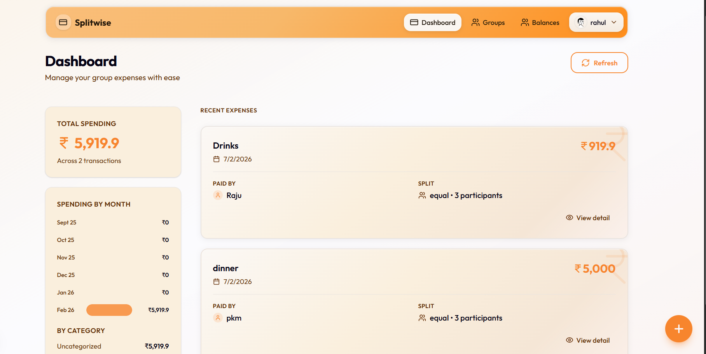
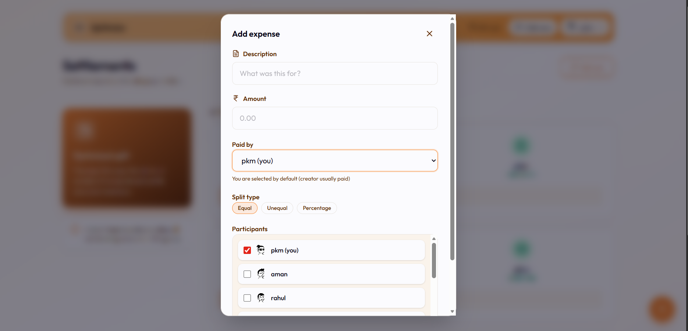
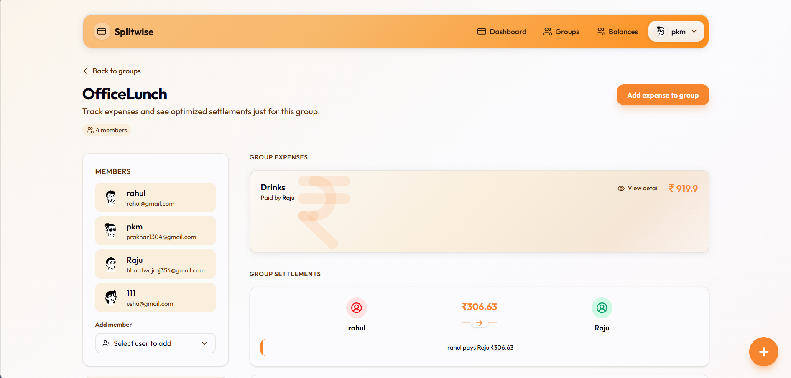
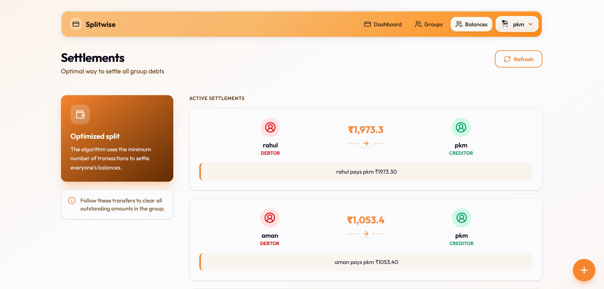

# Splitwise — Expense Sharing Application

A full-stack MERN expense sharing application similar to Splitwise. Track group expenses, split bills equally or unequally, and see optimized settlement suggestions.

## Screenshots









---

## Overview

This project implements all three levels of the MERN Splitwise Assessment:

- **Level 1:** Basic expense tracking, CRUD, balance calculation
- **Level 2:** User authentication (JWT), protected routes, user management
- **Level 3:** Group management, advanced splits (equal/unequal/percentage), settlement optimization

---

## Features

### Core
- Add, view, edit, and delete expenses (creator only)
- Equal, unequal, and percentage-based splits
- Balance calculation — who owes whom
- Settlement optimization — minimize number of transactions

### Authentication
- User registration and login (JWT)
- Protected routes
- Logout

### Groups
- Create groups with members
- Add members to existing groups
- Group-wise expenses and balances
- Delete group (creator only)

### UI/UX
- Responsive design with Tailwind CSS
- Dashboard with spending analytics (by month, by category)
- Floating action button for quick add
- Avatar generation for users

---

## Tech Stack

| Layer     | Technology                    |
|----------|--------------------------------|
| Frontend | Next.js 16, React 19, TypeScript |
| Styling  | Tailwind CSS 4                 |
| Backend  | Node.js, Express 5             |
| Database | MongoDB + Mongoose             |
| Auth     | JWT, bcrypt                    |

---

## Project Structure

```
splitwise/
├── backend/                 # Express API
│   ├── src/
│   │   ├── controller/      # Route handlers
│   │   ├── middleware/     # Auth, etc.
│   │   ├── model/          # Mongoose schemas
│   │   ├── router/         # API routes
│   │   ├── service/        # Settlement optimization logic
│   │   ├── utils/          # ApiError, ApiRes, asyncHandler
│   │   ├── app.js
│   │   └── index.js
│   └── package.json
├── frontend/                # Next.js app
│   ├── src/
│   │   ├── app/            # Pages (App Router)
│   │   ├── components/
│   │   ├── context/        # AuthContext
│   │   └── utils/          # API client
│   └── package.json
├── Images/
│   ├── Dashboard.png      # Dashboard screenshot
│   ├── AddExpenses.png    # Add expense form
│   ├── Group.png          # Groups view
│   └── settlement.png     # Settlement view
├── ALGORITHM_EXPLAINED.md  # Settlement algorithm docs
└── README.md
```

---

## Setup

### Prerequisites
- Node.js 18+
- MongoDB (local or Atlas)

### 1. Clone and install

```bash
git clone https://github.com/prakhar1304/Splitwise.git
cd splitwise
```

### 2. Backend

```bash
cd backend
npm install
```

Create `backend/.env`:

```env
MONGODB_URI=mongodb+srv://<user>:<password>@cluster0.xxxxx.mongodb.net
PORT=5000
ACCESS_TOKEN_SECRET=your_secret_here
ACCESS_TOKEN_EXPIRESIN=1d
REFRESH_TOKEN_SECRET=your_refresh_secret
REFRESH_TOKEN_EXPIRESIN=30d
```

Run:

```bash
npm run dev
```

Backend runs at `http://localhost:5000`

### 3. Frontend

```bash
cd frontend
npm install
```

Create `frontend/.env.local`:

```env
NEXT_PUBLIC_API_URL=http://localhost:5000/api
```

Run:

```bash
npm run dev
```

Frontend runs at `http://localhost:3000`

---

## API Endpoints

### Users
| Method | Endpoint | Description |
|--------|----------|-------------|
| POST | `/api/users/register` | Register user |
| POST | `/api/users/login` | Login |
| POST | `/api/users/logout` | Logout |
| GET | `/api/users/me` | Get current user |
| GET | `/api/users/all-users` | Get all users |
| GET | `/api/users/:id/avatar` | User avatar (SVG) |

### Groups
| Method | Endpoint | Description |
|--------|----------|-------------|
| POST | `/api/groups` | Create group |
| GET | `/api/groups` | Get user's groups |
| GET | `/api/groups/:id` | Get group details |
| POST | `/api/groups/:id/members` | Add member |
| DELETE | `/api/groups/:id` | Delete group (creator only) |

### Expenses
| Method | Endpoint | Description |
|--------|----------|-------------|
| POST | `/api/expenses` | Create expense |
| GET | `/api/expenses` | Get all expenses |
| GET | `/api/expenses/:id` | Get expense by ID |
| PUT | `/api/expenses/:id` | Update expense (creator only) |
| DELETE | `/api/expenses/:id` | Delete expense (creator only) |
| GET | `/api/expenses/group/:groupId` | Get group expenses |
| GET | `/api/expenses/balances` | Personal balances |
| GET | `/api/expenses/balances/group/:groupId` | Group balances |
| GET | `/api/expenses/analytics` | Dashboard analytics |

---


---

## License

ISC
